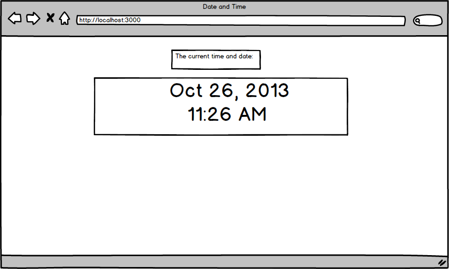

# Time Display!
Create a django project, called main!

Create a new app in your apps folder of your main django project called timedisplay (don't forget to add it to your main projects settings.py)

In timedisplay's controller (`views.py`), create a method named index.

When you go to the url localhost:8000 this should run the index method in your controller file, (`views.py`)

Maybe test out a google search something like:

` django get current time `

If you need a bit of a hint?

Here is a shiny wire frame!

