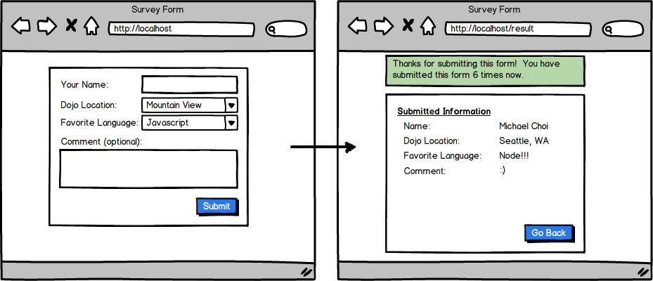

# Assignment Survey Form

Your next assignment is to build a new Django project to do what's shown below.  You can, just changes the settings of an old Django project, and change the main.urls.py file, or you can generate a whole new project...  We recommend the former, just to get the practice.

Doing the assignment from scratch will 1) reinforce the important concepts you want to master and 2) get you to build things a lot faster as each practice will help you optimize your process to make you a more efficient developer.

For any web app, it's critical that you understand how a FORM can be submitted and how POST data, as well as SESSION data, work. Understanding these core concepts are critical in building any web app. As you build the app described below, make sure you feel very comfortable with how information can be relayed between a form (from view), controller (found in views.py currently), and how session and post data are being handled.





### Good Practice

Now, one thing we want you to be familiar with, and apply in this assignment, as well as future assignments is to NOT have a single URL handle BOTH the POST submission as well as **render** the view file.  For example, the form that's rendered from http://localhost should be submitted NOT to /result but to say /surveys/process.  The controller/method that handles /survey/process should do all the logic, process POST data, manipulate SESSION data, store things into SESSION, and redirect to another URL, say '/result'.  The reason we have a method to handle POST/SESSION and another method to handle the view file is because it makes reading your code much easier. If the same URL handled both POST and the rendering of the view, when you reload that page, it RESUBMITS the form data. This is not a good thing as you probably intended that form data to be submitted just once.  


###### How to do this in Django?
In your controller file (named views.py), after you import render, also import redirect!
```python
from django.shortcuts import render, HttpResponse, redirect
```
In methods in your controller (for example):
```python
def runThis():
return redirect('/')
```
