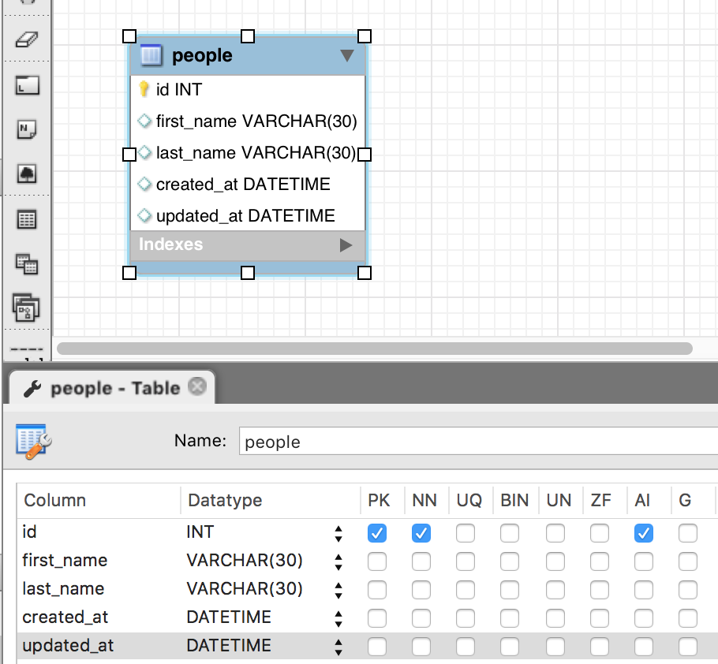

# Models in the MVC Structure

Models in the MVC architecture are the workhorses of data manipulation. They control which data are released to the controllers. Because of this, the phrase **skinny controllers and fat models** is often used, and is an important design principle:

> Any heavy logic including database queries is the purview of a Model. If a Controller (in Django's case, a View) needs to perform logic or get information from a database, it should use a Model method to do so.

Here's an analogy: When we call `list.reverse()` to reverse a list in Python, we don't care what goes on in the background (i.e. the logic of the `reverse` method), so long as it does what we wanted (reverse the dang list!).

The same principle can be applied in Django to the Model/View relationship. We want our views (controllers in MVC parlance) to call simple, clearly named methods of our models that can receive and return data in an organized way.

That way, if a colleague wanted to use one of these model methods, they could do so easily. (This shouldn't be an excuse to write ugly, overly verbose, unreadable code in your models, but a call (pun intended) to move much of the data logic to the model and return predictable outcomes).

While we are going to dive into Django Models from the database side, know that they can also be used for other types of data manipulation.

In Flask we created our database using `mysql-workbench` and validated user inputs based on the route we hit.

For example, maybe when we went to `/register`, our app checked all of the `request.form` elements to see if they were valid to register a user.

Across web frameworks such as Express (using something called Mongoose), Rails and Django, the models file does two things:

1. Gives information about what's inside the relevant SQL table
2. Provides a location the sort of validations we just talked about

###Model Practice
>Watch the video to make a new project/app from scratch and implement your first model!

<iframe width="420" height="315" src="https://www.youtube.com/embed/y0OR3KGy7Uw" frameborder="0" allowfullscreen></iframe>

Here's an example of this in Django (something that could be found in an `app/first_app/models.py` file):

```python
# Inside models.py
from __future__ import unicode_literals
from django.db import models
# Our Super Basic Model.
class People(models.Model):
    first_name = models.CharField(max_length=30)
    last_name = models.CharField(max_length=30)
    created_at = models.DateTimeField(auto_now_add=True)
    updated_at = models.DateTimeField(auto_now=True)
```
The previous code equates to this ERD diagram:



Our code also adds some basic validation (`max_length`).

Now think back to your Flask days. Creating an ERD diagram didn't actually create the database table(s). We had to *forward engineer* the diagram into SQL code, and then *run* that SQL code in a MySQL environment. There's an analogous process in Django:

To do the equivalent of forward engineer we are going to run a couple of commands from the terminal.
```bash
> python manage.py makemigrations
> python manage.py migrate
```

###*Remember:*
>**Never** delete migration files, and **always** `makemigrations` and `migrate` anytime you change something in your `models.py` files -- that's what updates the actual database so it reflects what's in your models.

The first command (`makemigrations`) tells Django:
>"Look and see if there have been any changes to the models files in our apps. If so, create the code (using built-in Django methods) that represents those changes."

The second command (`migrate`) says:
> **Forward engineer** those changes into our database! (I.e. turn the code generated inside a migration file into SQL commands and run those commands in local memory)

For development we are going to be using **SQLite** - a prepackaged SQL database that has much of the functionality of MySQL (but not all of it) and is stored as *local memory*.

For deployment we are going to be using **postGRES**, a SQL database that has some added functionality, making it a bit heavier, but a solid deployment option. (Alternatively, with some fiddling you can also deploy a MySQL database, which is a little bit faster than postGRES).

Now, how do we access our database?
