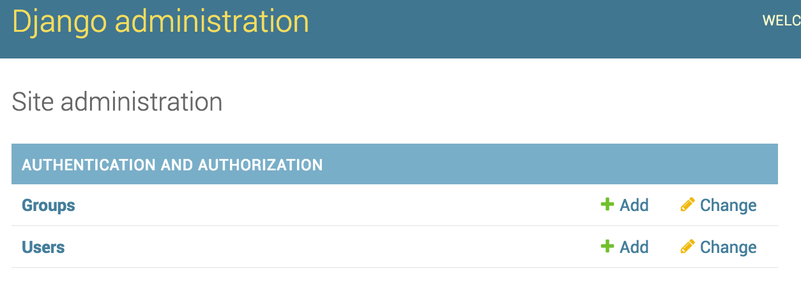

#Django Admin

Well done making it this far! We've already covered everything you'll need to pass the belt exam!

Now we're going to start implementing some more advanced functionality that really makes Django awesome.

###Let's first create a new project

```bash
> django-admin startproject initialAdmin
> cd initialAdmin
```

*Now make sure you make your migrations!*

```python
# Once we run migrate, we can create superuser
> python manage.py createsuperuser
# Follow prompts to fill in:
# Username
# Email address
# Password
# Password (again)
# Afterward you should see "Superuser created successfully."
> python manage.py runserver
```

Let's navigate to `localhost:8000/admin` in our browser and enter the information you just provided to the `createsuperuser` prompts.

If you see this:



###Congratulations!
You've reached the **admin portal** in Django, a fantastic tool to modify and play with things like your database data. (We avoided using this functionality earlier to prevent confusion with the routing and terminal commands.)

Now pretend we had an app `apps/awesomeApp` with a bunch of models, and we want to add those models to the manager.

We're going to add some code to our `urls.py` file that will link our app's models to Django's admin utility. In general, Django recommends you keep this code in the auto-generated `admin.py` file of your app, but we're going to stick it in `urls.py` for now just to keep our code in fewer places.

Let's update our project's `urls.py` file to the following:
```python
# From inside your project's urls.py file
from django.conf.urls import url, include
from django.contrib import admin

# THIS SECTION IS NEW!
# ********************
from apps.awesomeApp.models import User as U, Fruit, Donut, Group

class UAdmin(admin.ModelAdmin):
    pass
admin.site.register(U, UAdmin)

class FruitAdmin(admin.ModelAdmin):
    pass
admin.site.register(Fruit, FruitAdmin)

class DonutAdmin(admin.ModelAdmin):
    pass
admin.site.register(Donut, DonutAdmin)

class GroupAdmin(admin.ModelAdmin):
    pass
admin.site.register(Group, GroupAdmin)
# ****************

urlpatterns = [
# Your app's urls is lined to the project
    url(r'^admin/',admin.site.urls),
    url(r'^awesomeApp/', include('apps.awesomeApp.urls')),
]
```

Now refresh the admin page in your browser -- all your models/data should be viewable!
