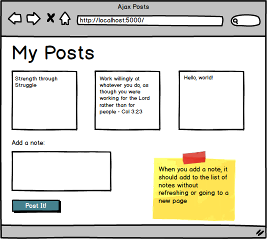

#Django w/ Ajax

By now you've gotten fairly comfortable building full-fledged Django applications. Well done!

There is, however, an issue we haven't yet addressed -- one that's **essential** to building modern web applications. Here's the problem: In all our applications to date, we've needed to refresh the browser each time we emit an HTTP request. Every time we've clicked a link to view a specific user's profile; every time we've submitted a form -- it's all gone hand in hand with a page reload.

To illustrate this issue, build a simple Django project/app according to the wireframe below:

###Note:
> At this point, just ignore the yellow Post-It note -- We'll deal with that feature soon enough.

Done? Excellent! Your application may look a little something like [this](https://github.com/meadch/django-ajax-posts) (feel free to `clone` the repo for reference).
