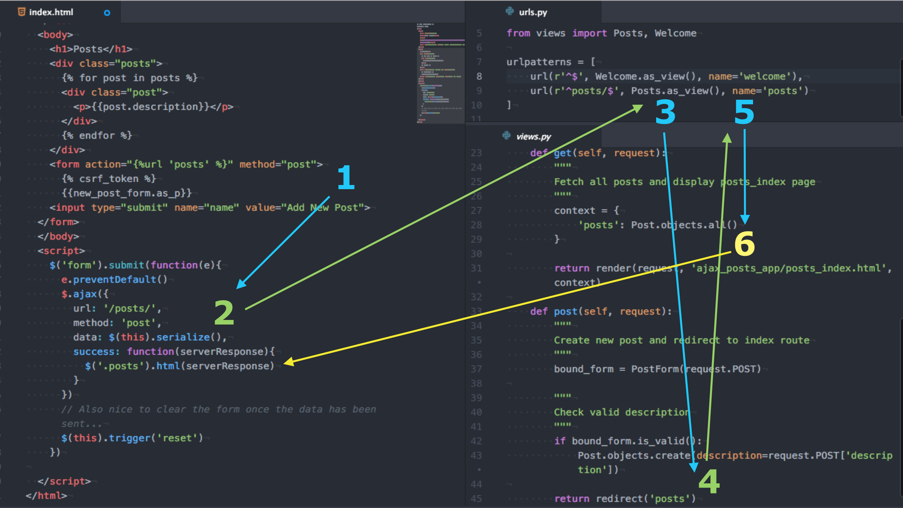

#Connecting Ajax

If you came up with something like the following code, nice job!

```js
$('form').submit(function(e){
  e.preventDefault()
  $.ajax({
    url: '/posts/',
    method: 'post',
    data: $(this).serialize(),
    success: function(serverResponse){
      console.log("Received this from server: ", serverResponse)
      console.log("I should probably put that in the DOM...")
    }
  })
})
```

> If you haven't seen the `.serialize()` method, it's just a helpful way to create a text string that our server can easily parse.

Pause for a moment to really think about the following: You just added some JavaScript to take care of an HTTP request/response on the front-end; at this point *you haven't changed a single line of code on the server-side*. Remember: The server **doesn't care** whether a request is initiated via your browser's address bar, an HTML `<form>` submission or an Ajax request.

Likewise, we didn't change any of the HTML that our server rendered! The `<form>` is still created the same as before (the example repo uses Django's `forms.ModelForm` feature).

###Acronym break

This is probably as good a time as any to mention what Ajax stands for: **Asynchronous Javascript And Xml**. That's a bit of a mouthful; the important thing to remember about this technique is that we're running code *asynchronously*, i.e. the `function` we attached to the `success` key only runs when the server responds. That's why they're known as **callback** functions -- it's code the JavaScript engine can call back to at the right time.

Now back to business. If you logged the server's response, you'll notice we're responding with the HTML that our server generates from rendering a template.

The problem with the current state of things is that we don't need the entire HTML file! All we really care about is the section with the posts, and one strategy to deal with this is to make another template that holds only that code:

```html
<!-- Inside a new template that we'll call posts_index.html -->
<div class="posts">
  
  <div class="post">
    <p>{{post.description}}</p>
  </div>
  
</div>
```

Now let's refactor our `views` so that a GET request to `/posts` renders the new template. Let's also make a root route that will render the full `index.html` page and update our `urls.py` files accordingly.

Here are our views:

```python
class Welcome(View):
    def get(self, request):
        """
        Fetch all posts and render full index page with form
        """
        context = {
            'posts': Post.objects.all(),
            'new_post_form' : PostForm()
        }

        return render(request, 'ajax_posts_app/index.html', context)

class Posts(View):
    def get(self, request):
        """
        Fetch all posts and display posts_index page
        """
        context = {
            'posts': Post.objects.all()
        }

        return render(request, 'ajax_posts_app/posts_index.html', context)

    def post(self, request):
        """
        Create new post and redirect to index route
        """
        bound_form = PostForm(request.POST)

        """
        Check valid description
        """
        if bound_form.is_valid():
            Post.objects.create(description=request.POST['description'])

        return redirect('posts')
```

And here are our urls:

####App-level urls
```python
# Inside the app's urls.py file
urlpatterns = [
    url(r'^$', Welcome.as_view(), name='welcome'),
    url(r'^posts$', Posts.as_view(), name='posts')
]
```

####Project-level urls
```python
# Inside the app's urls.py file
urlpatterns = [
    # The admin url came with our project -- we haven't used it yet
    url(r'^admin/', admin.site.urls),
    url(r'^', include('apps.ajax_posts_app.urls')),
]
```

###Update the DOM
The only thing left to do is have our JavaScript put the actual response into the DOM:

```js
// Inside the $.ajax() call
success: function(serverResponse){
          // Replace the html inside a div with the class "posts" with the server response
          $('.posts').html(serverResponse)
        }
```

That's all it takes! Hopefully you can see the power of using Ajax requests to give your app a sleeker feel. Checked out `with-ajax` branch of the [reference repo](https://github.com/meadch/django-ajax-posts/tree/with-ajax) if you want to review the full code. Here's a diagram that tracks the data flow of an Ajax request:

1. Form submitted by user
2. Ajax request sent to server w/ form data
3. Server catches `POST` route to `/posts` and directs to `Posts`'s `post` method
4. `post` method creates new post and `redirects` back to routes
5. Routes catch a `GET` route to `/posts` and directs to `Posts`'s `get` method
6. `get` method returns a rendered template to the browser
7. Callback function pinned to the `success` key runs with the server response passed in as an argument and updates DOM.


