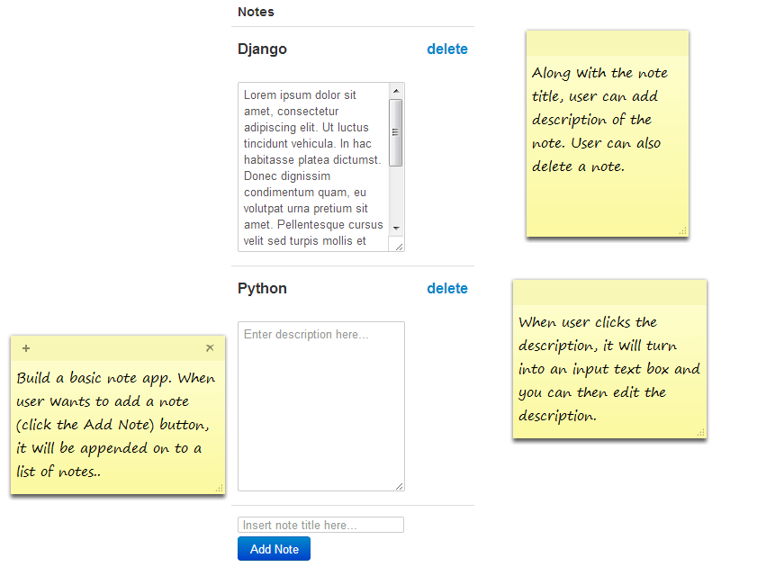

#Assignment: Ajax Notes

Create a Django Note Manager Application where you can add, edit and delete a note. When you're building applications, understanding how many forms you need can be a huge help:

Look at the image below and ask yourself how many forms you might need for the assignment...

If you said 3, we're on the same page:

1. Form for creating a note
2. For every note, a form for updating that note's information (title, description)
  + Extra challenge: implement this feature without showing a submit `button`
3. For every note, a form for deleting that note

One piece of advice that students generally find **extremely** helpful:

Build this app without using *any* JavaScript/Ajax calls initially. Once everything is working, refactor your code with Ajax calls.

####Extra
+ Implement database validations and flash messaging
